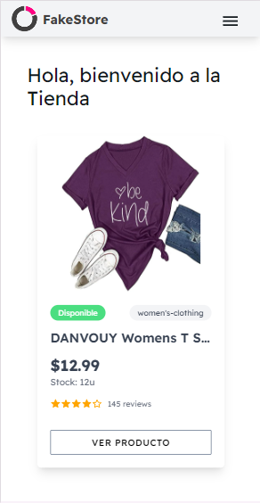
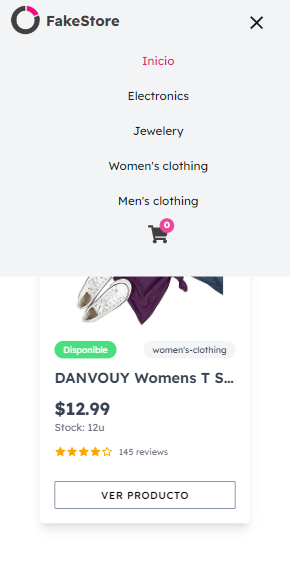
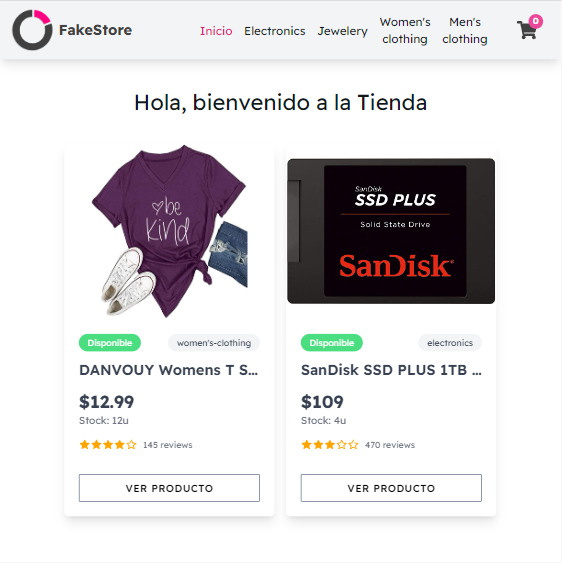
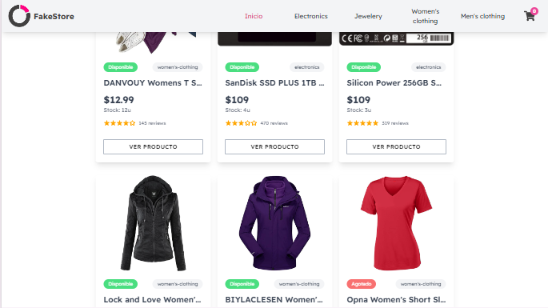
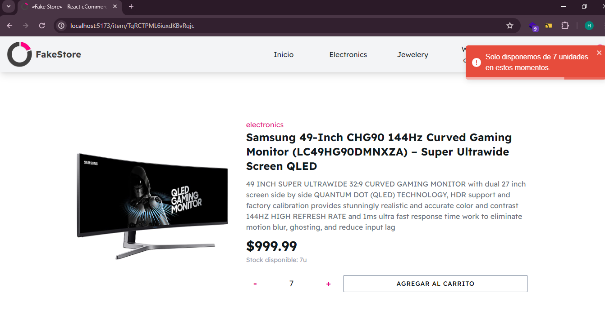
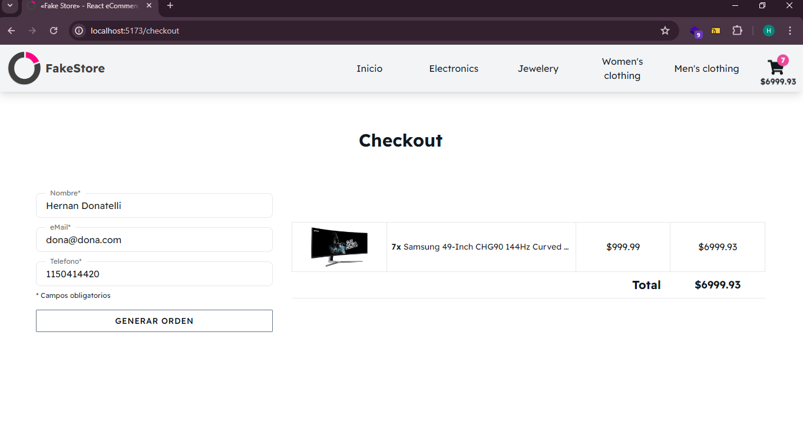

# Proyecto Final Ecommerce Fake Store
## Curso de React Coderhouse

### Mobile

### Tablet

### PC

### Sin Stock suficiente

### Checkout

 

Proyecto de una app ecommerce para el curso de React.js en Coderhouse. Se utiliza productos de la API de Fake Store (https://fakestoreapi.com/) para simular una tienda de variadas categorias, los cuales fueron subidos a Firestore (base de datos de Firebase), que se utiliza como backend. El sitio es Full Responsive, adaptado para mobile, tablet y desktop según los breakpoints que utiliza Tailwindcss

El proyecto funcionando: https://ecommerce-react-coder.netlify.app

<h2>Tecnologías Utilizadas</h2>

<ul>
    <li>Html5</li>
    <li>Css3</li>
    <li>React.JS v18.2.0</li>
    <li>Vite v5.2.0</li>
    <li>Tailwindcss v3.4.3</li>
    <li>AOS v2.3.4 (animate on scroll)</li>
    <li>Firebase v10.12.0</li>
    <li>React-Router-Dom v6.22.3</li>
    <li>React-Toastify v10.0.5</li>
    <li>React-Icons v5.0.1</li>
</ul>

<h2>Usabilidad</h2>

El sistema es un ecommerce donde su puede ver un catalogo de todos los productos en su Homepage y en su Menu posee las categorias donde se agrupan los mismos, pudiendo filtrarse por ellas. Tambien alli encontramos una imagen del carrito de compras con los items agregados y el subtotal al momento a modo de resumen.

Cada tarjeta de producto posee su imagen, nombre, precio, categoria, y se puede observar a primera vista si hay disponibilidad de stock o no, pero permitiendo de todas formas ver una descripcion detallada de cada articulo y sus caracteristicas.
 
Ya dentro de cada producto podemos agregar o quitar cantidades del item, para luego agregarlo al carrito de compras. Una vez agregados, el subtotal se actualiza automaticamente y podemos finalizar la compra o continuar eligiendo otros items para pasar al Checkout y realizar el pedido.

En el Checkout se pueden observar los items agregados, donde puede eliminar productos y/o vaciar el carrito. Para hacer efectivo el pedido se le pide completar los datos del formulario, y una vez completos (obligatorios) se finaliza la operacion generandose un ID de pedido.

Por ultimo, una vez generado el pedido se le envia un email (mediante Email.js) con informacion de la compra y el pedido realizado al cliente con el ID del mismo.

<h2>Autor</h2>
<ul>
    <li>Hernán Donatelli</li>
</ul>